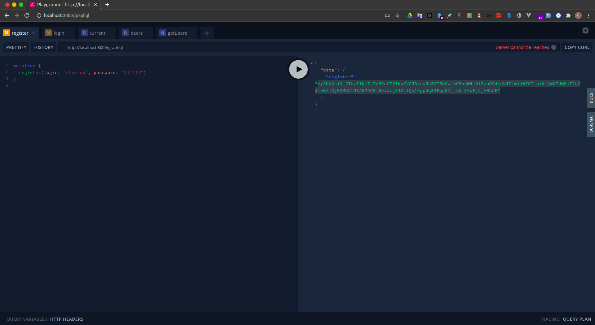
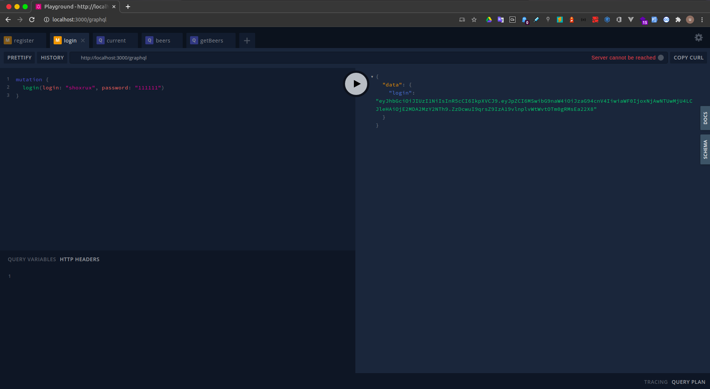
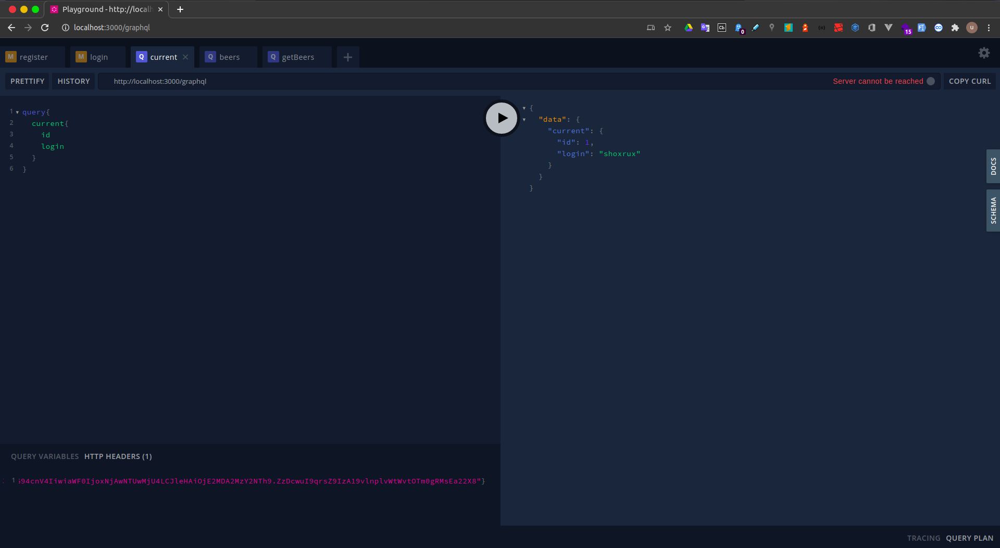
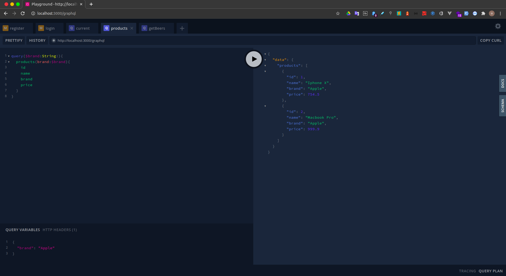
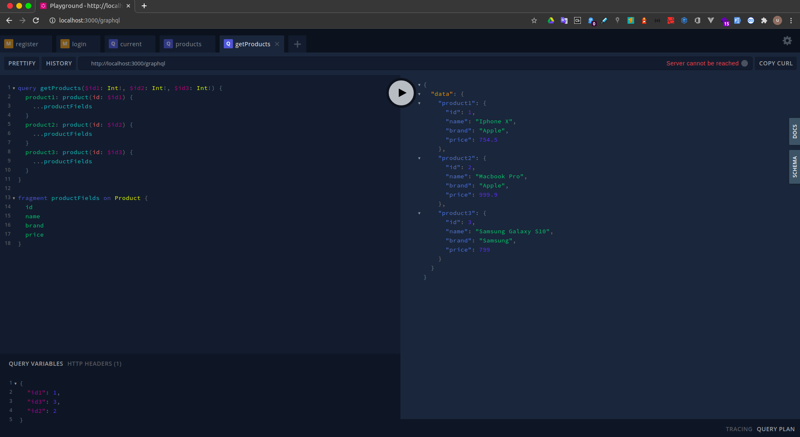

## Getting started 🚀
- Create an empty `.env` file in `/backend`, copy `/backend/.env.example` contents into it, and fill in your jwt secret and other.
- Create an empty `config.json` file in `/backend/src/config`, copy `/backend/src/config/config.example.json` contents into it, and fill in your database username and password.
- `npm run install-deps`
- `npm run start:back`
- App should now be running on `http://localhost:3000/`
- App Graphql should now be running on `http://localhost:3000/graphql`

## Inspiration and Why not? 🤷‍♀️

- Your `idea` Here

## Screens
  
  
  
  
  
